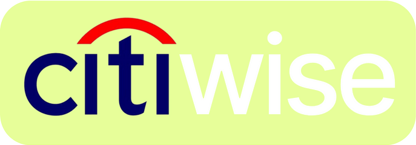
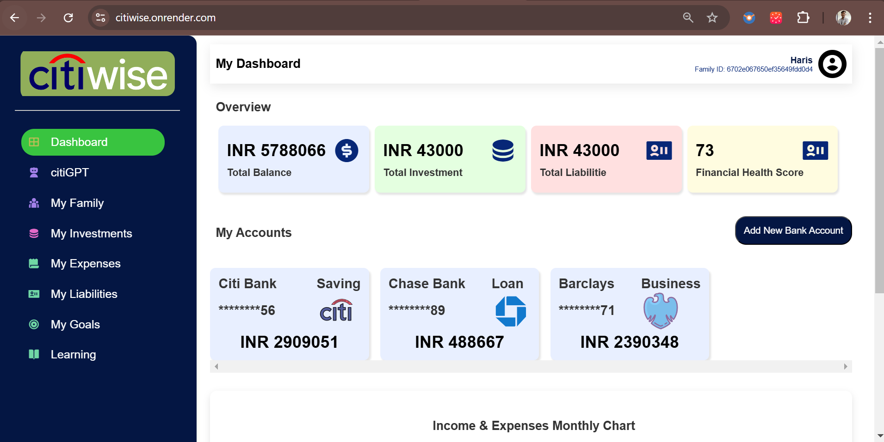
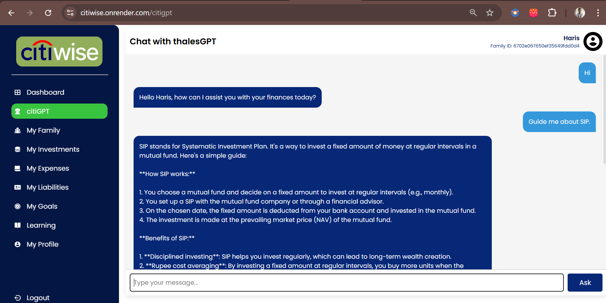
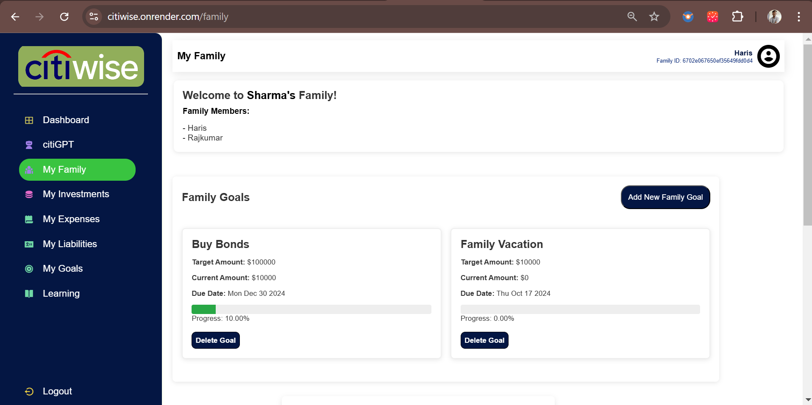
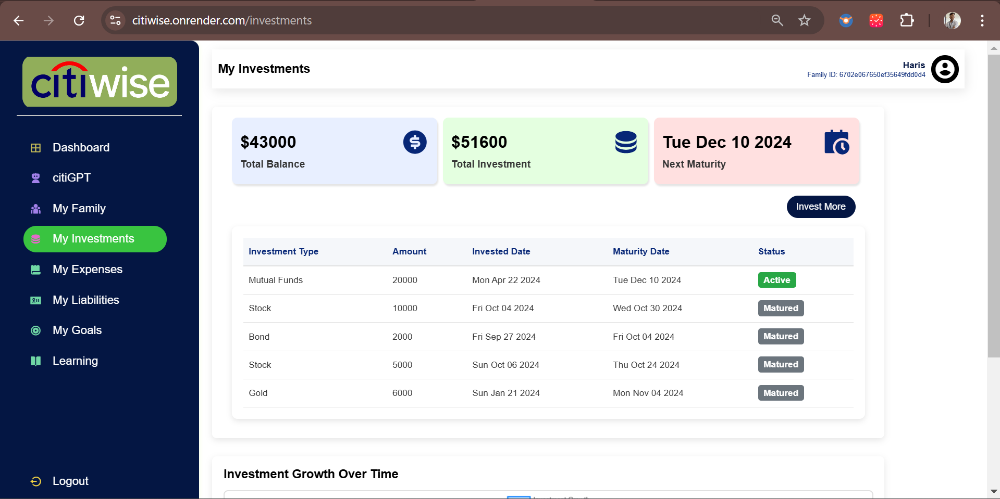
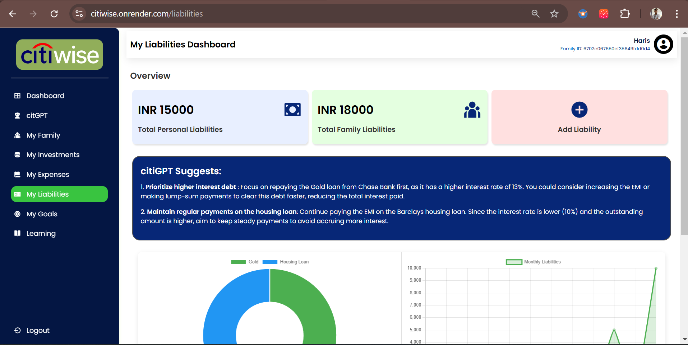

<!-- PROJECT LOGO -->
<div align="center">
    <!--  -->
    
  <h1 align="center"><b>citiWise: AI-Powered Companion for Smarter Financial Health and Family Wealth Management.</b></h1>

</div>

<!-- ABOUT THE PROJECT -->
<br>

## ♾️ Problem Statement

Enhancing Customer Experience in Banking and Finance - Empowering Customers with AI-Driven Financial Insights.

## ♾️ Solution

Citiwise is a personalized financial advisory platform designed to help users make better financial decisions with features like a dual scoring system to monitor credit and financial health, AI-driven spending and saving goals, and personalized investment suggestions based on risk tolerance and income. It enables families to manage all accounts in one place, offering clear visualizations for better financial tracking. Additionally, Citiwise includes innovative tools like citiGPT, an AI financial assistant, a gamified self-paced learning path for financial literacy, and daily learning challenges to encourage user engagement and improve financial management skills.

## ⚙️ Built With

The technologies and tools used are:

- LLM
- Langchain
- Groq
- Pinecone
- NLP
- HTML
- CSS
- Javascript
- Python
- NodeJS
- ExpressJS
- Bootstrap

<!-- GETTING STARTED -->

## 🧑‍💻 Getting Started

### Installation

1. Clone the repository

   ```sh
   git clone https://github.com/sanketdisale871/citiWise.git
   ```

2. Install the dependencies:

   ```sh
   npm i
   ```

3. Start Application:
   ```sh
   nodemon index.js
   ```

<!-- CONTRIBUTING -->

## Some Glimpses of WorkConnect

- Dashboard
  

- citiGPT
  

- My Family
  

- My Investments
  

- My Liabilities
  
